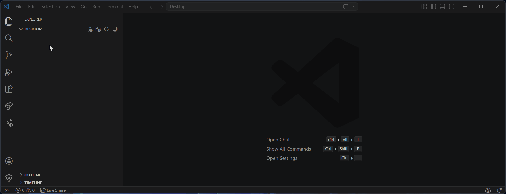

# Docx Markdown Editor

Edit DOCX content as Markdown directly in VS Code, then round-trip changes back to the original document with Pandoc.

  

## Features

- Open `.docx` files as Markdown
- Sync edits back to `.docx` on save
- Convert Markdown, DOCX, and HTML to other supported formats
- Create a new blank `.docx` file from the Explorer context menu

## Requirements

- Pandoc installed and available on `PATH`

## Usage

1. Right-click a `.docx` file in Explorer.
2. Choose **Open as Markdown**.
3. Edit the generated `.md` file.
4. Save the file to write changes back to `.docx`.
5. Right-click a folder and choose **New .docx..** to create a blank document.

## Conversion

- `.docx` -> `.md`, `.pdf`, `.html`
- `.md` -> `.docx`, `.pdf`, `.html`, `.epub`
- `.html` -> `.md`, `.docx`, `.pdf`

## Notes

- Temporary Markdown files are created alongside the source as `.docx.md`.
- Newly created documents start as `new-document.docx` and can be renamed immediately.
- If Pandoc is missing, conversion commands will fail with a clear error message.

## Release Notes

See [CHANGELOG.md](./CHANGELOG.md) for version history.
